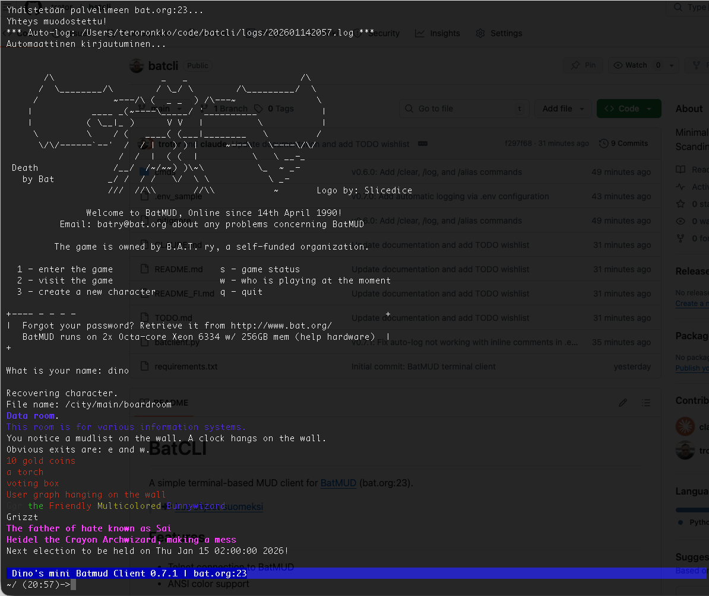

# BatCLI

Yksinkertainen terminaalipohjainen MUD-client [BatMUD](https://www.bat.org)-peliin (bat.org:23).



## Ominaisuudet

- Telnet-yhteys BatMUD:iin
- ANSI-värituki
- ISO-8859-1 merkistökoodaus (pohjoismaiset merkit)
- Unicode-syöttötuki
- Komentohistoria (Ctrl-P / Ctrl-N)
- Rivin muokkaus kursorilla
- Vieritys taaksepäin tulostushistoriassa
- Automaattinen kirjautuminen .env-tiedostosta
- **Prompt hold**: MUD:n prompt (IAC GA/EOR) näkyy syöttörivillä
- **Salasanan piilotus**: Syöte piilotetaan kun palvelin pyytää salasanaa
- **Yhteydenhallinta**: Selkeät ilmoitukset yhteyden katketessa tai virhetilanteissa
- **Debug-tila**: Näytä raaka telnet-data komennolla `/debug on`
- **Sessioiden tallennus**: Tallenna sessiot tiedostoon `/log`-komennolla
- **Automaattinen loggaus**: Aloita loggaus automaattisesti .env:stä
- **Käyttäjäaliakset**: Luo pikakomentoja `/alias`-komennolla

## Vaatimukset

- Python 3.7+
- Ei ulkoisia riippuvuuksia (käyttää vain standardikirjastoa)

## Asennus

```bash
git clone https://github.com/yourusername/batcli.git
cd batcli
```

### Globaali komento (valinnainen)

Tee `batcli`-komennosta käytettävä mistä tahansa hakemistosta:

```bash
# Tee skriptistä suoritettava
chmod +x batclient.py

# Luo ~/bin-hakemisto ja lisää se PATH:iin (jos ei jo tehty)
mkdir -p ~/bin
echo 'export PATH="$HOME/bin:$PATH"' >> ~/.zshrc  # tai ~/.bashrc bashille

# Luo symlink
ln -sf "$(pwd)/batclient.py" ~/bin/batcli

# Lataa shell-asetukset uudelleen
source ~/.zshrc  # tai ~/.bashrc
```

Nyt voit ajaa `batcli`-komennon mistä tahansa hakemistosta.

### Valinnainen: Automaattinen kirjautuminen

```bash
cp .env_sample .env
# Muokkaa .env-tiedostoon omat tunnuksesi
```

### Valinnainen: Automaattinen loggaus

Ota automaattinen sessioiden tallennus käyttöön lisäämällä `.env`-tiedostoon:

```bash
AUTO_LOG=true
LOG_DIR=/polku/logeihin  # Valinnainen, oletus: logs/
```

### Valinnainen: Emoji-indikaattorit

Käytä emojeja tekstin sijaan status-palkissa:

```bash
STATUS_EMOJI=true  # Näyttää 📝 🐛 tekstien LOG DBG sijaan
```

## Käyttö

```bash
# Jos asennettu globaalisti:
batcli

# Tai aja suoraan projektihakemistosta:
python3 batclient.py
```

### Pikanäppäimet

| Näppäin | Toiminto |
|---------|----------|
| Enter | Lähetä komento |
| Vasen/Oikea | Siirrä kursoria |
| Ylös | Siirry rivin alkuun |
| Alas | Siirry rivin loppuun |
| Ctrl-P | Edellinen komento historiasta |
| Ctrl-N | Seuraava komento historiasta |
| Ctrl-A | Siirry rivin alkuun |
| Ctrl-E | Siirry rivin loppuun |
| Ctrl-U | Tyhjennä rivi |
| Ctrl-K | Poista kursorista rivin loppuun |
| Page Up/Down | Vieritä tulostushistoriaa |
| Home/End | Vieritä alkuun/loppuun |

### Komennot

Kaikki `/`-alkuiset komennot käsitellään clientissa. Käytä `//` lähettääksesi `/` palvelimelle (esim. `//who` lähettää `/who`).

| Komento | Toiminto |
|---------|----------|
| `/help` | Näytä ohje |
| `/clear` | Tyhjennä näyttö |
| `/log [on\|off]` | Aloita/lopeta sessioiden tallennus |
| `/alias [nimi] [cmd]` | Luo tai listaa aliakset |
| `/alias -d <nimi>` | Poista alias |
| `/debug on\|off` | Debug-tilan vaihto |
| `/quit` | Poistu clientista |

## Tietoturvahuomautus

Telnet on salaamaton protokolla. Tunnuksesi lähetetään selkokielisinä. Tämä on MUD-protokollan rajoitus, ei tämän clientin. Käytä MUD-peleissä uniikkeja salasanoja.

## Lisenssi

MIT

## Linkit

- [BatMUD](https://www.bat.org) - Peli
- [BatMUD Wiki](https://batmud.fandom.com) - Pelin wiki
